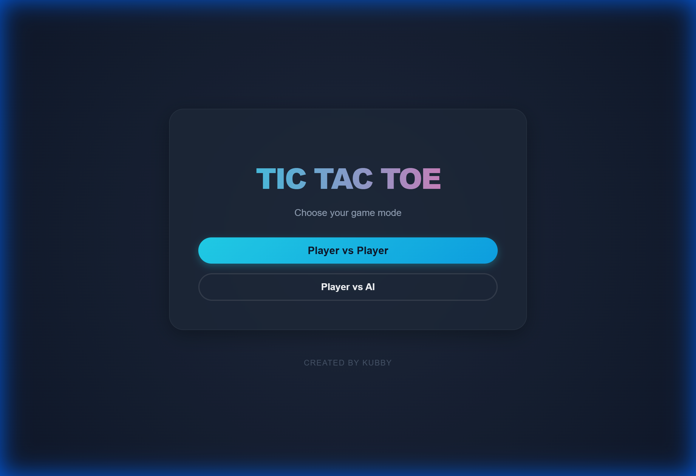
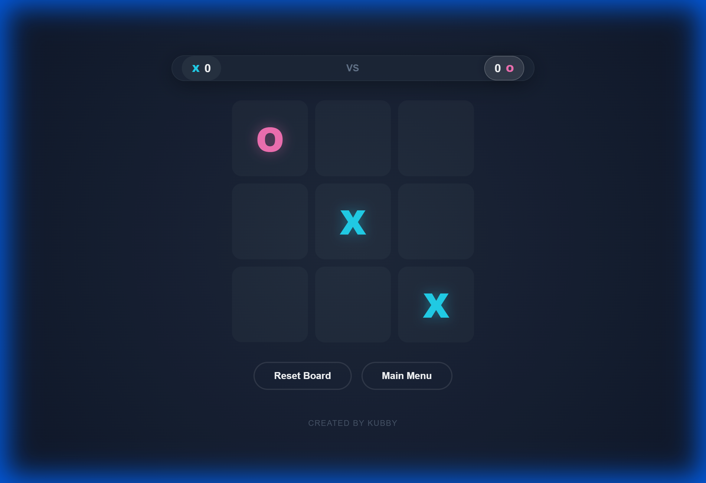

# 🎮 Tic-Tac-Toe Premium

> A modern, polished Tic-Tac-Toe experience featuring smart AI, glassmorphism aesthetics, and smooth animations. Created by Kubby.



## ✨ Features

- **Two Game Modes**:
  - ⚔️ **Player vs Player**: Challenge a friend on the same device.
  - 🤖 **Player vs AI**: Test your skills against a smart AI opponent powered by the Minimax algorithm.
- **Premium Design**:
  - 🎨 **Glassmorphism UI**: Sleek, translucent panels and neon accents.
  - 🎬 **Smooth Animations**: Satisfying pop-in effects and transitions.
  - 📱 **Fully Responsive**: Optimized for desktop, tablet, and mobile.
- **Smart Logic**:
  - 🧠 **Unbeatable AI**: The AI plays optimally, making it a true challenge.
  - ⚡ **Instant Feedback**: Real-time win detection and score tracking.



## 🚀 Getting Started

### Prerequisites
- Node.js (v14 or higher)
- npm or yarn

### Installation

1. Clone the repository:
   ```bash
   git clone https://github.com/yourusername/tictactoe.git
   ```
2. Navigate to the project directory:
   ```bash
   cd tictactoe
   ```
3. Install dependencies:
   ```bash
   npm install
   ```
4. Start the development server:
   ```bash
   npm run dev
   ```

## 🕹️ How to Play

1. **Select Mode**: Choose between PvP or PvAI from the main menu.
2. **Make a Move**: Click on any empty cell to place your symbol (X or O).
3. **Win Condition**: Get 3 of your symbols in a row, column, or diagonal to win.
4. **Draw**: If the board fills up without a winner, it's a draw.
5. **Reset**: Use the "Reset Board" button to clear the grid or "Main Menu" to switch modes.

## 🛠️ Technologies Used

- **React**: Component-based UI architecture.
- **Vite**: Blazing fast build tool and dev server.
- **CSS3**: Custom animations, variables, and glassmorphism effects.
- **Minimax Algorithm**: Recursive logic for the AI opponent.

## 👨‍💻 Author

**Kubby** - *Visionary Game Creator*

---
*Enjoy the game!* 🎮
